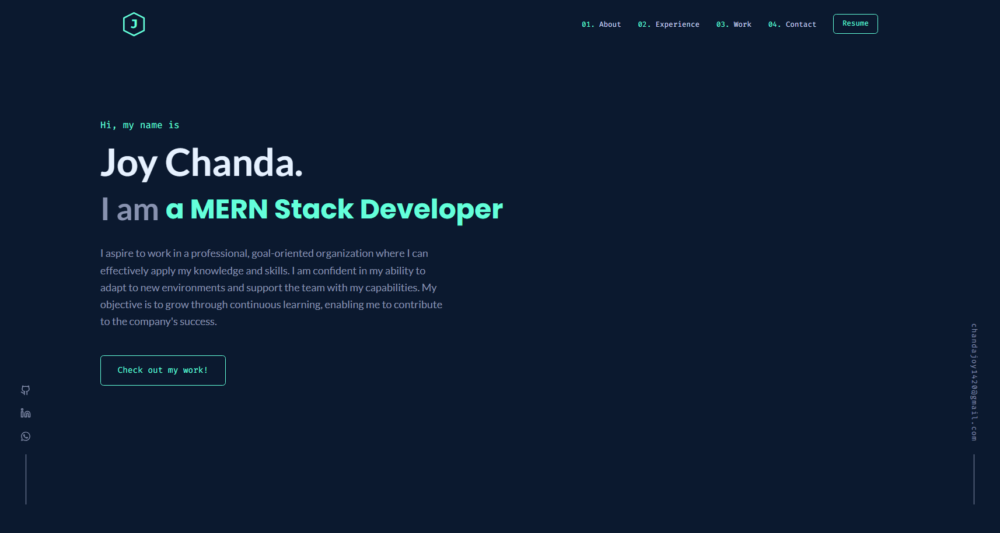
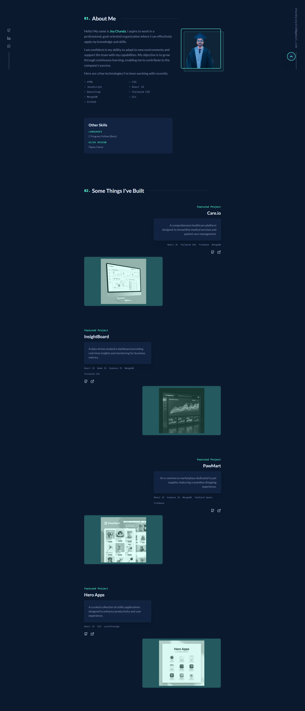
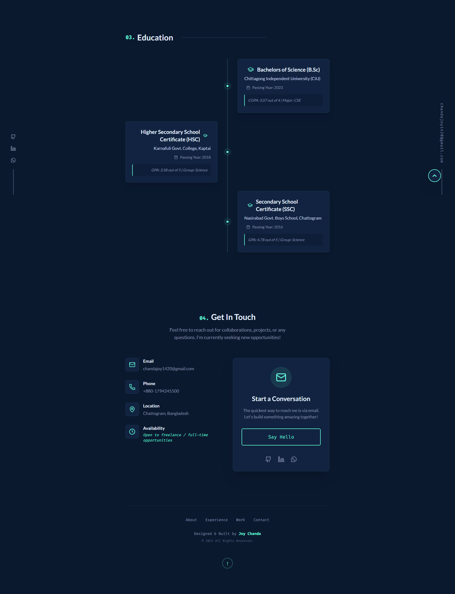

# Joy Chanda - Full Stack Developer Portfolio

Welcome to my professional portfolio! This website is built with **Next.js**, **TypeScript**, and **Tailwind CSS**, featuring a premium design inspired by modern web aesthetics.

## 🚀 Live Demo

Check out the live version of my portfolio here: https://joys-portfolio-gamma.vercel.app/





## ✨ Features

- **Premium Animations:** Smooth scroll animations and element transitions using Framer Motion.
- **Initial Error Animation:** A specialized "This Site Can't Be Reached" error sequence that transitions into the main site, inspired by classic web experiences.
- **Glassmorphism UI:** Modern navigation and components with blur effects and semi-transparent layers.
- **Responsive Design:** Fully optimized for mobile, tablet, and desktop devices.
- **Featured Projects:** Showcasing my best work with interactive thumbnails and detailed descriptions.
- **Education Timeline:** A structured vertical timeline of my academic background.

## 🛠️ Tech Stack

- **Framework:** [Next.js](https://nextjs.org/) (App Router)
- **Styling:** [Tailwind CSS v4](https://tailwindcss.com/)
- **Animations:** [Framer Motion](https://www.framer.com/motion/)
- **Icons:** [Lucide React](https://lucide.dev/)
- **Language:** [TypeScript](https://www.typescriptlang.org/)

## 🛠️ Getting Started

### Prerequisites

- Node.js (v18 or higher)
- npm or yarn

### Installation

1. Clone the repository:
   ```bash
   git clone https://github.com/JoyChanda/joy-portfolio.git
   ```
2. Navigate to the project directory:
   ```bash
   cd joy-portfolio
   ```
3. Install dependencies:
   ```bash
   npm install
   ```
4. Start the development server:
   ```bash
   npm run dev
   ```

## 👤 About Me

I aspire to work in a professional, goal-oriented organization where I can effectively apply my knowledge and skills. I am confident in my ability to adapt to new environments and support the team with my capabilities. My objective is to grow through continuous learning, enabling me to contribute to the company's success.

## 📧 Contact Me

- **Email:** chandajoy1420@gmail.com
- **LinkedIn:** [joy-chanda](https://www.linkedin.com/in/joy-chanda/)
- **GitHub:** [JoyChanda](https://github.com/JoyChanda)
